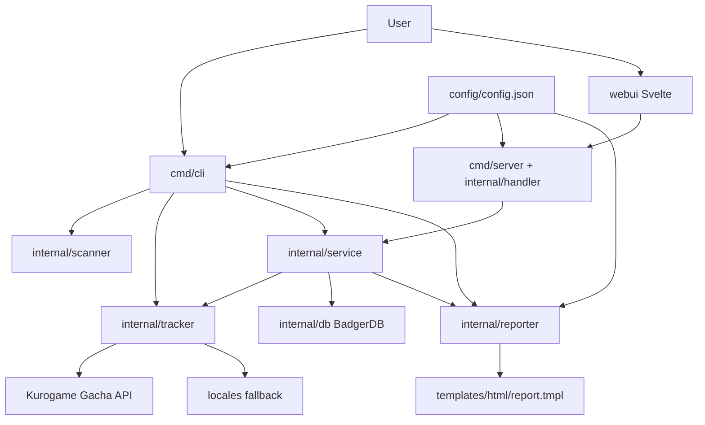
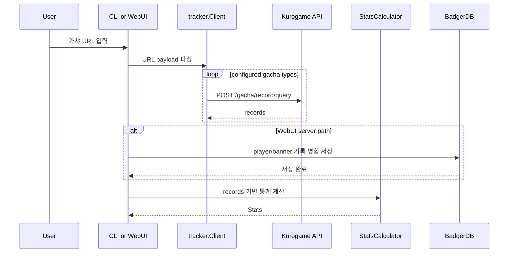
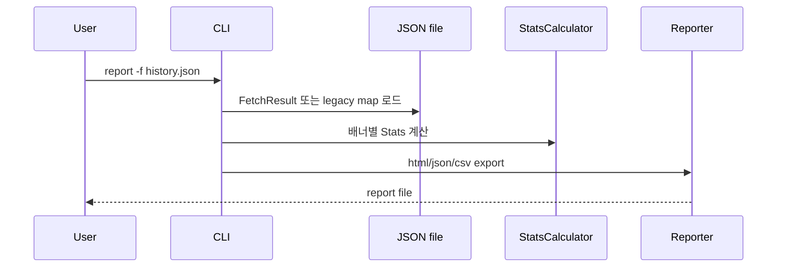

# Wuwa Tracker Design

## 기준

- Updated Date: 2026-05-27
- 기준 커밋: `c767fe0`
- Source of Truth: 실제 구현 코드
- 주요 근거 파일: `cmd/cli/main.go`, `cmd/server/main.go`, `internal/handler/handler.go`, `internal/service/service.go`, `internal/tracker/stats.go`, `internal/db/badger.go`, `webui/src/App.svelte`

## Architecture Overview

Wuwa Tracker는 Go 기반 CLI/서버와 Svelte WebUI로 구성된 로컬 우선(local-first) 가챠 기록 분석 도구입니다.

핵심 설계는 다음과 같습니다.

- `config/config.json`은 가챠 배너 정의, 기대 소요, 상시 5성 리소스, 운 점수 임계값을 제공하며 `go:embed`로 바이너리에 포함됩니다.
- `locales` 패키지는 가챠 배너명 fallback 로케일과 WebUI/HTML 리포트용 UI 번역을 함께 embed합니다.
- CLI는 `scan`, `report`, `run` 서브커맨드로 분리되어 있으며, `report`와 `run`은 BadgerDB에 기록을 병합 저장한 뒤 DB 기준 통계를 생성합니다.
- 서버는 Go Fiber v3로 HTTP API와 임베디드 Svelte 정적 파일을 함께 제공합니다.
- `internal/service`는 DB, 설정, tracker client, stats calculator를 외부에서 주입받아 CLI와 handler가 공유하는 유스케이스를 제공합니다.
- 서버 저장소는 BadgerDB이며, 플레이어 ID와 배너 key를 조합한 `gacha:<playerId>:<cardPoolType>` key에 기록 배열을 저장합니다.
- WebUI는 서버 API만 호출하며, 운 점수 표시 문구와 색상 클래스는 프론트에서 `state` enum 값 기준으로 매핑합니다.

## Component Details

### CLI

`cmd/cli/main.go`는 서브커맨드 라우터입니다.

- `scan`: `cmd/cli/scan/scan.go`에서 게임 로그 경로를 받아 URL을 추출합니다.
- `report`: `cmd/cli/report/report.go`에서 URL 기반 온라인 모드 또는 JSON 파일 기반 오프라인 모드로 DB에 기록을 병합 저장하고 리포트를 생성합니다.
- `run`: `cmd/cli/main.go`의 `runAll`에서 URL 스캔, API 조회, DB 병합 저장, 리포트 생성을 한 번에 수행합니다.

현재 CLI는 루트 플래그 방식이 아니라 `wuwa-tracker <command> [arguments]` 방식입니다.

### Server API

`cmd/server/main.go`는 다음 작업을 수행합니다.

- `WUWA_TRACKER_HOST`, `WUWA_TRACKER_PORT`, `WUWA_TRACKER_DB_PATH`, `WUWA_TRACKER_CORS_ORIGINS` 환경 변수와 `-host`, `-port`, `-dbpath` 플래그를 처리합니다.
- `config.Load()`로 설정을 로드합니다.
- 원격 또는 로컬 fallback 로케일을 이용해 가챠 배너 이름을 매핑합니다.
- BadgerDB와 tracker client, stats calculator를 생성한 뒤 service에 주입하고 Fiber 미들웨어(`recover`, `logger`, `cors`)와 API 라우트를 등록합니다.
- `webui.FS`를 정적 파일 시스템으로 서빙합니다.
- 시그널 기반 graceful shutdown 시 DB를 닫습니다.

API 라우트는 `internal/handler/handler.go`에 구현되어 있습니다.

- `POST /api/track`: URL에서 `player_id`를 추출하고 배너별 기록을 조회한 뒤 DB에 병합 저장합니다.
- `POST /api/upload`: 업로드된 `FetchResult` 데이터를 배너별로 DB에 병합 저장합니다.
- `GET /api/stats/:playerId`: 저장 기록으로 통계를 계산합니다.
- `GET /api/players`: 저장된 플레이어 ID 목록을 반환합니다.
- `GET /api/config`: `luckScoreThresholds`를 반환합니다.
- `GET /api/i18n`: 요청 언어의 UI 번역 map을 반환하며, 실패 시 `ko`로 fallback합니다.
- `GET /api/export/:playerId`: 저장 기록을 `html`, `json`, `csv`로 다운로드합니다.

### Data Fetching

`internal/tracker/api.go`는 Kurogame URL에서 payload를 파싱하고 API 엔드포인트를 결정합니다.

- `ParsePayloadFromURL`은 query string 또는 fragment query에서 `player_id`, `svr_id`, `record_id`, `lang`, `gacha_id`를 추출합니다.
- `getAPIEndpoint`는 `aki-gm-resources...` 도메인을 `gmserver-api.../gacha/record/query`로 매핑합니다.
- `FetchRecords`는 배너 타입별 POST 요청으로 기록을 가져옵니다.
- `FetchAllRecords`는 설정된 모든 배너를 순회합니다. 개별 배너 조회 실패는 로그를 남기고 계속 진행합니다.

### Locale Strategy

`internal/tracker/locale.go`는 배너 이름 로케일을 다음 순서로 찾습니다.

1. 원격 로케일 endpoint의 요청 언어
2. 임베디드 로컬 로케일의 요청 언어
3. 요청 언어가 `ko`가 아니면 원격 `ko`
4. 임베디드 로컬 `ko`
5. 모두 실패하면 빈 map

CLI 온라인 모드는 URL의 `lang`을 우선 사용하고, 없으면 `internal/scanner`의 시스템 로케일 감지를 사용합니다. CLI 오프라인 모드는 외부 로케일 API를 호출하지 않고 배너 key를 이름으로 사용합니다.

UI 번역은 `locales/ui/*.json`에 저장하고 `locales.LoadUITranslationsWithFallback`으로 로드합니다. WebUI는 `/api/i18n?lang=...` 응답을 사용하고, HTML 리포트 exporter는 같은 로더를 직접 호출합니다.

`locales` 패키지의 리소스 구분은 다음과 같습니다.

- `locales/{lang}.json`: 가챠 배너명 등 게임 데이터 표시용 fallback 로케일
- `locales/ui/{lang}.json`: WebUI와 HTML 리포트가 공유하는 UI 문구

새 UI 문구를 추가할 때는 `locales/ui/ko.json`, `locales/ui/en.json`에 같은 key를 추가하고, Svelte 또는 HTML template에서는 해당 key만 참조합니다. 프론트엔드는 번역 JSON을 직접 import하지 않습니다.

JSON 로딩은 `loadJSON[T]` 제네릭 헬퍼를 사용합니다. 호출부는 `map[string]any`, `map[string]string`처럼 필요한 반환 타입을 명시하고, 별도 캐스팅용 loader를 두지 않습니다.

### Persistence and Merge

`internal/db/badger.go`는 BadgerDB wrapper입니다.

- 저장 key는 `gacha:<playerId>:<cardPoolType>`입니다.
- `SaveGachaRecords`는 기존 데이터를 지우는 단순 덮어쓰기가 아니라 `MergeRecords`로 기존 기록과 신규 기록을 병합합니다.
- `ListPlayers`는 `gacha:` prefix key를 key-only iterator로 스캔합니다.

`internal/db/merge.go`의 병합 전략은 다음 순서입니다.

1. 신규 기록 suffix와 기존 기록 prefix의 시퀀스 오버랩 매칭
2. 오버랩이 없으면 시간대 기준 앞/뒤 추가 가능 여부 판단
3. 시간대가 교차하면 시간별 union merge와 정렬 수행

이 설계는 명조 API가 최근 일정 기간 데이터만 제공하는 상황에서 기존 로컬 기록을 보존하기 위한 것입니다.

### Statistics

`internal/tracker/stats.go`는 배너별 `Stats`를 계산합니다.

- API 기록은 최신순이라고 가정하고, 과거부터 순회하기 위해 역순으로 처리합니다.
- 5성/4성 pity를 누적하고, 5성 획득 시 `FiveStarRecord`를 생성합니다.
- `hasOffBannerDrop`이 true인 배너는 `standardFiveStarResources`에 포함된 리소스를 픽뚫로 판단합니다.
- 평균 5성 소요, 실제 5성 비율, 현재 pity, Luck Score를 계산합니다.
- Luck Score는 픽업 주기 기준으로 기대 소요 합계와 실제 소요 합계를 비교합니다.

### Reporter

`internal/reporter`는 exporter 인터페이스와 포맷별 구현을 제공합니다.

- JSON: `ReportData`를 pretty-print JSON으로 출력합니다.
- CSV: 배너별 전체 기록을 평탄화해 행 단위로 출력합니다.
- HTML: `templates/html/report.tmpl`에 통계, `luckScoreThresholds`, UI 번역 함수를 주입합니다.

HTML 템플릿은 Tailwind CDN과 Google Fonts를 사용합니다. 따라서 생성된 HTML은 파일 자체는 로컬 산출물이지만 스타일/폰트 렌더링에는 외부 CDN 접근이 관여합니다.

### WebUI

`webui/src/App.svelte`는 전체 상태를 관리합니다.

- mount 시 `/api/config`, `/api/players`를 호출합니다.
- 저장된 플레이어가 있으면 첫 플레이어 통계를 자동 로드합니다.
- URL 동기화는 `/api/track`, JSON 업로드는 `/api/upload`, 저장 플레이어 조회는 `/api/stats/:playerId`를 호출합니다.
- 다운로드 링크는 `/api/export/:playerId?format=...`를 직접 사용합니다.

`webui/src/lib/i18n.ts`는 로컬 JSON을 import하지 않고 `/api/i18n`에서 번역 map을 받아 Svelte store에 저장합니다. `webui/src/lib/components/GachaReport.svelte`는 `LuckScoreState` (`worst`, `bad`, `normal`, `good`, `best`)를 i18n 표시 문구와 Tailwind 클래스에 매핑합니다. 서버 설정은 점수 구간과 상태 enum만 제공합니다.

## Data Flow

### Online CLI / WebUI Track

### Offline Report

## Operational Notes

- CGO는 사용하지 않습니다.
- 외부 통신은 Go 표준 `net/http` 클라이언트를 통해 수행합니다.
- 서버 기본 수신 주소는 `127.0.0.1:3000`, 기본 DB 경로는 `data/wuwa_badger`입니다. 환경 변수는 `WUWA_TRACKER_HOST`, `WUWA_TRACKER_PORT`, `WUWA_TRACKER_DB_PATH`, `WUWA_TRACKER_CORS_ORIGINS`를 사용하며, CLI 플래그가 환경 변수보다 우선합니다.
- Makefile은 Go/Yarn 캐시를 `.cache/` 아래로 고정하고, `make clean`으로 빌드 산출물과 로컬 캐시를 정리합니다.
