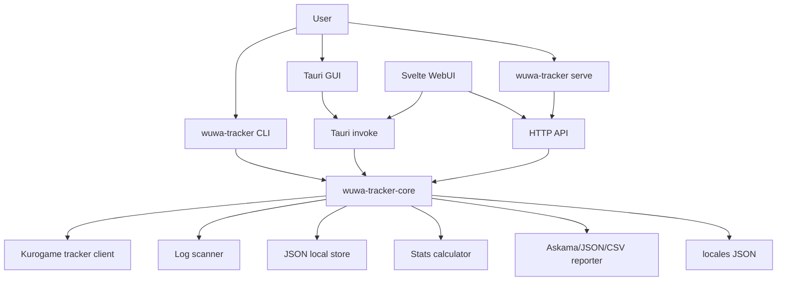

# Wuwa Tracker Design

- Updated Date: 2026-06-15

## Architecture Overview

Wuwa Tracker는 Rust workspace와 Svelte WebUI로 구성된 local-first 트래커입니다. 기본 실행은 Tauri GUI이며, `serve` subcommand는 binary에 embed된 WebUI asset과 HTTP API를 제공합니다.

## Component Details

### Workspace

- `crates/wuwa-tracker-core`: 데이터 모델, 설정, Kurogame API client, 로그 URL 스캐너, 기록 병합, JSON 저장소, 통계 계산, 리포트 export, 번역 로딩을 담당합니다.
- `crates/wuwa-tracker-app`: `wuwa-tracker` binary를 제공합니다. Tauri GUI, embedded WebUI를 제공하는 Axum HTTP server, CLI subcommand를 같은 core service 위에서 실행합니다.
- `webui`: Svelte UI입니다. Tauri runtime에서는 `invoke`를 사용하고, 브라우저/server mode에서는 HTTP API를 사용합니다.
- `locales`: game locale fallback과 UI locale JSON입니다.

### Runtime Modes

- GUI: `make run` 또는 `cargo run -p wuwa-tracker`
- WebUI server: `make serve` 또는 `cargo run -p wuwa-tracker -- serve --host 127.0.0.1 --port 3000`
- CLI: `cargo run -p wuwa-tracker -- <command> [args]`

지원 CLI command:

- `version`
- `scan`
- `report`
- `run`
- `backup`
- `merge`
- `db players`
- `serve`

### Data Flow

Online track flow:

1. GUI/WebUI/CLI가 gacha URL을 입력받습니다.
2. `tracker::TrackerClient`가 URL query 또는 fragment query에서 payload를 파싱합니다.
3. 설정된 banner type을 순회하며 Kurogame `/gacha/record/query` API를 호출합니다.
4. `Service`가 결과를 JSON store에 병합 저장합니다.
5. `StatsCalculator`가 pity, 5성 이력, Luck Score를 계산합니다.

Offline upload/report flow:

1. `FetchResult` JSON 또는 legacy `map<string, Record[]>` JSON을 읽습니다.
2. player ID를 payload 또는 파일명에서 결정합니다.
3. JSON store에 병합 저장한 뒤 같은 stats/report path를 사용합니다.

### Persistence

기본 저장소는 `~/.wuwa-tracker/store.json`입니다. 구조는 player ID와 banner key를 기준으로 기록 배열을 저장합니다.

병합 전략:

1. 신규 기록 suffix와 기존 기록 prefix의 sequence overlap matching
2. overlap이 없으면 시간대 기준 앞/뒤 append
3. 시간대가 교차하면 시간 기반 union merge

`backup`과 `merge`는 이 JSON store 포맷을 대상으로 동작합니다.

### Reporting

- HTML: `askama` template인 `crates/wuwa-tracker-core/templates/report.html`을 컴파일 타임에 검증하고 렌더링합니다.
- JSON: `ReportData` pretty JSON
- CSV: 기록 단위 flat CSV

### WebUI API

Server mode는 다음 route를 제공합니다.

- `POST /api/track`
- `POST /api/upload`
- `GET /api/stats/{player_id}`
- `GET /api/players`
- `GET /api/config`
- `GET /api/i18n`
- `GET /api/export/{player_id}`

GUI mode는 같은 기능을 Tauri command로 호출합니다.

## Notes

- Svelte `webui`는 유지합니다.
- HTML 리포트는 Askama template로 렌더링합니다.
