# 명조: 워더링 웨이브 - 통합 튜닝 통계 트래커 (Wuwa Tracker Suite)

명조: 워더링 웨이브(Wuthering Waves)의 튜닝(가챠) 기록을 수집 및 분석하여 누적 스택, 천장(Pity) 계산, 획득한 5성 캐릭터/무기 히스토리를 시각화하는 통합 도구 패키지입니다. 

단일 실행 파일로 패키징된 **임베디드 Svelte WebUI 웹 서버**와 **터미널 전용 CLI 수집 도구**, 그리고 **오프라인 리포트 생성기**가 모두 포함되어 있어 사용 환경에 맞추어 유연하게 활용할 수 있습니다.

---

## 🚀 핵심 아키텍처 및 주요 기능

본 프로젝트는 Go 언어의 강력한 이식성을 극대화하여 **CGO가 없고 외부 런타임 의존성이 없는 순수 단일 바이너리** 구조로 빌드됩니다.

### 1. 🌐 WebUI & API 서버 (`wuwa-tracker-server`)
* **임베디드 Svelte 프론트엔드**: Svelte 기반으로 개발된 프리미엄 다크 테마 대시보드 정적 리소스가 Go 바이너리 내부에 컴파일 시점(`go:embed`)에 내장됩니다. 별도의 Node.js 설치 없이 실행 파일 단 하나만으로 구동됩니다.
* **로컬 REST API 서버**: Go Fiber 프레임워크로 구동되는 가볍고 강력한 백엔드 API 서버를 내장하고 있습니다.
* **오프라인 JSON 업로드**: 외부 공식 API 요청 없이도, 백업해 둔 로컬 JSON 파일을 웹 UI에 업로드하여 즉시 데이터를 분석하고 로컬 데이터베이스(BadgerDB)에 영구 저장 및 조회할 수 있습니다.
* **유연한 서버 제어**: 포트(`-port`)와 로컬 DB 저장 경로(`-db`)를 가볍게 CLI 플래그로 입력받아 제어할 수 있습니다.

### 2. 💻 CLI 분석 및 스캔 도구 (`wuwa-tracker`)
* **로그 파일 스캔**: 명조 게임이 설치된 설치 경로(`-path`)를 지정하면, 어플리케이션이 게임 로그 파일(`Client.log` / `debug.log`)을 자동으로 스캔하여 가장 최신의 튜닝 기록 URL을 스스로 찾아내어 즉시 분석을 수행합니다.
* **평탄화(Flattened) 포맷 내보내기**: 수집된 가챠 상세 정보를 CSV 및 JSON 형태의 1차원 데이터로 평탄화하여 내보내므로, R/Python 이나 Excel 프로그램으로 즉시 심화 데이터 분석이 가능합니다.
* **정밀한 운 점수 (Luck Score) 계산기**: 한정 캐릭터 배너의 50/50 픽뚫 규칙(PickUp Cycle)이 수학적으로 정확히 투영되어 있습니다. 상시 캐릭터를 뽑는 데 소비된 개별 스택이 다음 픽업 캐릭터 획득 주기 스택에 자동 합산되어 기댓값과 비교 평가됩니다.

### 3. 📊 스탠드얼론 리포터 (`wuwa-reporter`)
* 로컬에 저장된 백업 JSON 데이터를 가공하여, 인터넷 브라우저에서 바로 실행 가능한 고해상도 프리미엄 인터랙티브 HTML 대시보드 파일(`report.html`)을 즉시 빌드해 주는 오프라인 변환 유틸리티입니다.

---

## 🛠️ 개발 환경 및 빌드 방법

### 개발 환경 (Prerequisites)
* **Go**: 1.20 버전 이상 권장
* **Node.js & Yarn** (WebUI 빌드 시 필요): v16 이상
* **CGO 미사용**: `CGO_ENABLED=0` 환경에서 순수 Go로 빌드되어 OS 간 완벽한 이식성을 보장합니다.

### 통합 빌드 및 실행 프로세스

루트 디렉토리에 제공되는 [Makefile](file:///Users/yooseongmin/Projects/meteormin/wuwa-tracker/Makefile)을 통해 터미널 명령어 한 줄로 프론트엔드와 백엔드를 모두 컴파일할 수 있습니다.

```bash
# 1. 프론트엔드(Svelte) 컴파일 및 전체 도구 빌드 (강력 권장)
# Svelte 소스 빌드 -> dist 폴더 생성 -> Go embed를 통한 바이너리 단일 통합 컴파일 수행
make build-all

# 2. 개별 모듈 빌드
make build-cli        # CLI 도구만 빌드 (bin/wuwa-tracker)
make build-server     # WebUI 포함 API 서버 빌드 (bin/wuwa-tracker-server)
make build-reporter   # 리포터 유틸리티 빌드 (bin/wuwa-reporter)

# 3. 코드 린팅 및 전체 단위 테스트 실행
make fmt
make lint
make test
```

---

## 💻 사용 방법 (Usage)

### 1. WebUI 서버 실행 및 활용 (`wuwa-tracker-server`)
가장 편리한 방법입니다. 로컬 웹 서버를 구동하여 브라우저에서 인터랙티브하게 관리합니다.

```bash
# 기본 포트(8080) 및 로컬 DB 파일 경로로 서버 구동
./bin/wuwa-tracker-server

# 커스텀 포트 및 데이터베이스 경로 설정 구동
./bin/wuwa-tracker-server -port 9090 -db "./my_data/badger"
```
* 서버가 구동되면 웹 브라우저를 열고 **`http://localhost:8080`** (또는 지정한 커스텀 포트)에 접속합니다.
* **대시보드 주요 기능**:
  * **가챠 URL 조회**: 복사한 튜닝 기록 URL을 입력창에 넣고 동기화 버튼을 누르면 실시간으로 최신 데이터가 패치되어 로컬 DB에 자동 덮어쓰기 저장됩니다.
  * **과거 기록 자동 추적**: 로컬 DB에 저장된 플레이어 ID 리스트가 좌측 사이드바에 실시간 로드되어, 이전 가챠 통계를 즉석에서 골라 조회할 수 있습니다.
  * **오프라인 JSON 업로드**: "JSON 업로드" 버튼을 클릭하여 기저장된 백업 가챠 파일을 업로드하고 분석할 플레이어 ID를 설정하면 서버가 오프라인 환경에서도 통계를 완벽하게 생성해 줍니다.

### 2. CLI 전용 수집기 활용 (`wuwa-tracker`)
터미널 환경에서 빠르게 데이터를 다운로드하거나 리포트를 파일로 떨구고 싶을 때 유용합니다.

```bash
# 기본 분석 실행 예시 (가챠 URL을 직접 입력하여 HTML 리포트 생성)
./bin/wuwa-tracker -url "https://aki-gm-resources-oversea.aki-game.net/aki/gacha/index.html?..."

# 로컬 명조 게임 설치 폴더를 직접 스캔하여 가챠 URL 자동 감지 및 분석
./bin/wuwa-tracker -path "C:\Program Files\Wuthering Waves\Wuthering Waves Game"

# 데이터 포맷을 JSON으로 지정하고 저장 파일명을 'stats'로 설정
./bin/wuwa-tracker -url "가챠URL" -format json -out stats
```

#### CLI 플래그 안내
| 플래그 | 타입 | 기본값 | 설명 |
| :--- | :--- | :--- | :--- |
| `-url` | `string` | `""` | 분석할 명조 공식 가챠 기록 URL을 입력합니다. |
| `-path` | `string` | `""` | 명조 설치 폴더(Wuthering Waves Game 폴더)를 지정하여 게임 로그 파일에서 자동으로 URL을 파싱 및 조회합니다. |
| `-format` | `string` | `"html"` | 분석 리포트의 저장 포맷을 지정합니다. (`html`, `csv`, `json` 지원) |
| `-out` | `string` | `"report"` | 생성할 리포트 파일의 이름을 지정합니다. (지정한 포맷에 맞춰 자동 확장자 부여) |

### 3. 스탠드얼론 리포터 활용 (`wuwa-reporter`)
```bash
# 저장된 가챠 JSON 로컬 파일 데이터를 프리미엄 대시보드 report.html 파일로 변환
./bin/wuwa-reporter -in logs/my_history.json -out my_report.html
```

---

## 📂 프로젝트 구조 (Directory Structure)

```bash
wuwa-tracker/
├── cmd/
│   ├── cli/
│   │   └── main.go         # CLI 분석 도구 진입점 및 분석 파일 출력 파이프라인
│   └── server/
│       └── main.go         # API 웹 서버 구동, CORS 제어, 라우터 매핑, 정적 리소스 호스팅
├── config/
│   ├── config.json         # 가챠 배너별 기대 스택값, 언어 리소스 및 운 점수 임계치 정의
│   └── embed.go            # config.json의 compile-time 컴베딩 관리
├── internal/
│   ├── server/
│   │   ├── db/
│   │   │   └── badger.go   # 가볍고 빠른 순수 Go 로컬 NoSQL 데이터베이스(BadgerDB) 제어
│   │   └── handlers/
│   │       └── handlers.go # REST API 요청 처리 (Sync, Upload, Stats 조회, Config 배포 등)
│   ├── reporter/
│   │   ├── csv.go          # Excel/Google Sheets용 1차원 평탄화 데이터 변환기
│   │   ├── html.go         # embed된 리포트 템플릿 기반 오프라인 대시보드 빌더
│   │   └── json.go         # JSON Array 평탄화 추출기
│   ├── tracker/
│   │   ├── api.go          # Kurogame 공식 가챠 로그 데이터 및 locales 로컬라이제이션 다운로더
│   │   └── stats.go        # 스택 연산 알고리즘 및 픽업 사이클 기반 운 점수(Luck Score) 판별기
│   └── types/
│       └── types.go        # 전체 어플리케이션 공통 데이터 규격 정의
├── templates/
│   ├── html/
│   │   └── report.tmpl     # Tailwind CSS 및 가이드 툴팁이 내장된 반응형 대시보드 템플릿
│   └── template.go         # report.tmpl 컴파일 컴베딩 패키지
├── webui/
│   ├── src/
│   │   └── App.svelte      # 3단 그리드 모던 대시보드 UI, JSON 업로더 및 사이드바 로드 컴포넌트
│   └── embed.go            # Svelte 빌드 결과물(dist/)의 Go static 내장 임베딩 선언
└── Makefile                # 프론트엔드/백엔드 컴파일, 테스트, 포맷 빌드 자동화 스크립트
```

---

## 🔄 시스템 구동 흐름도 (Data Sequence)

```mermaid
sequenceDiagram
    autonumber
    actor User as 사용자
    participant UI as Svelte WebUI (Browser)
    participant Server as Server (Go Fiber)
    participant DB as 로컬 DB (BadgerDB)
    participant Config as config.json
    participant API as 공식 가챠 API

    User->>UI: 웹 화면 접속 (localhost:8080)
    UI->>Server: GET /api/config
    Server-->>UI: 운 점수 임계값(Thresholds) 등 설정 데이터 주입
    
    rect rgb(20, 30, 45)
        Note over User, API: [방법 A] 공식 URL을 통한 실시간 데이터 동기화
        User->>UI: 가챠 URL 입력 후 동기화 요청
        UI->>Server: POST /api/track { url }
        Server->>Config: 배너 메타데이터 로드
        Server->>API: FetchGachaRecords() (페이지네이션 순회)
        API-->>Server: []Record (순수 데이터 목록)
        Server->>DB: SaveGachaRecords() (플레이어별 중복 없는 자동 적층)
    end

    rect rgb(30, 20, 35)
        Note over User, DB: [방법 B] 오프라인 JSON 백업 데이터 업로드
        User->>UI: JSON 파일 드래그 & 플레이어 ID 설정
        UI->>Server: POST /api/upload { playerId, data }
        Server->>DB: SaveGachaRecords() (로컬 데이터베이스에 덮어쓰기 적층)
    end

    Server->>DB: GetGachaRecords() (통계 갱신을 위해 데이터 조회)
    DB-->>Server: []Record
    Server->>Server: CalculateStats() (5성 스택, 픽업 사이클 및 운 점수 정밀 분석)
    Server-->>UI: StatsResponse { statsList } (최신 통계 렌더링용 JSON 반환)
    UI-->>User: 3열 모던 대시보드 시각화 정보 출력 완료
```


