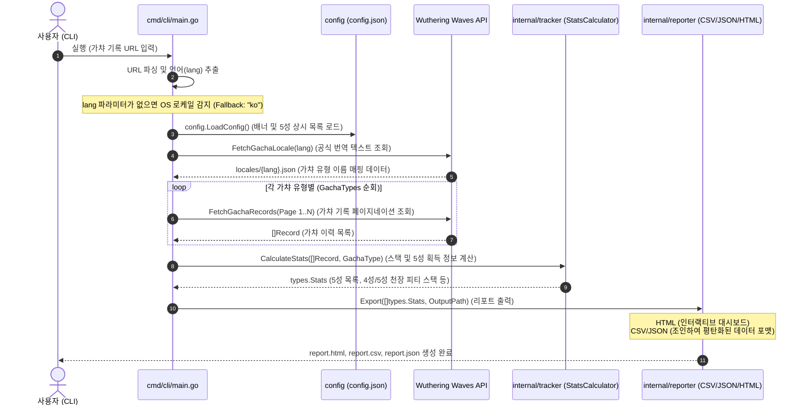

# 명조: 워더링 웨이브 - 튜닝 통계 트래커 (Wuwa Tracker CLI)

명조: 워더링 웨이브(Wuthering Waves)의 튜닝(가챠) 기록 URL을 분석하여 누적 스택, 천장(Pity) 계산, 획득한 5성 캐릭터/무기 히스토리를 요약하고, 이를 프리미엄 인터랙티브 HTML 대시보드와 데이터 분석용 CSV/JSON 포맷으로 출력하는 Go 기반 CLI 도구입니다.

---

## 🚀 주요 기능 및 특징

1. **완벽한 다국어 지원 및 시스템 로케일 Fallback**
   * 게임 기록 URL에서 언어(`lang`) 파라미터를 자동 추출하여 다국어 번역을 적용합니다.
   * URL에 언어 파라미터가 누락된 경우, OS 시스템 환경 변수(`LC_ALL`, `LANG`)를 파싱하여 적절한 시스템 로케일(예: `ko_KR` -> `ko`)을 자동으로 추적하며, 최종 실패 시 `"ko"`로 안전하게 대체됩니다.
2. **동적 가챠 구성 시스템 (Hardcoding Zero)**
   * 가챠 배너 정보나 5성 상시 목록이 코드 내에 하드코딩되어 있지 않습니다.
   * 임베드된 `config.json` 설정 파일과 공식 게임 리소스 서버의 다국어 번역 리소스(`locales/{lang}.json`)를 실시간으로 다운로드하여 완전히 동적으로 매핑합니다.
3. **평탄화(Flattened) 데이터 내보내기**
   * **CSV/JSON**: 획득 이력이 3★, 4★, 5★ 전체 기록 단위로 가챠 유형 및 가챠 명칭 정보와 Join되어 1차원으로 평탄화(Flatten)된 상태로 저장되므로, 엑셀이나 외부 통계 툴에서 즉시 데이터 분석을 시작할 수 있습니다.
4. **프리미엄 인터랙티브 HTML 대시보드**
   * 시각적으로 높은 만족도를 주는 모던 다크 테마 대시보드를 제공합니다.
   * **상호작용형 운 지수(Luck Index) 계산기**: 사용자가 웹 브라우저에서 실시간으로 각 배너의 "평균 기대 뽑기 횟수" 및 "기본 확률"을 수정하면 실시간으로 운 상태(예: '비정상적인 행운! 🔥', '극악의 억까 상태... 💀') 및 지수(%)를 동적으로 재계산합니다.
   * **접기/펼치기 전체 히스토리**: 대량의 뽑기 목록을 등급별 색상 배지와 함께 콤팩트한 스크롤 드로어 컴포넌트로 축소하여 브라우저 과부하 없이 편안한 스크롤 조회를 제공합니다.

---

## 💻 사용법 (Usage)

본 어플리케이션은 빌드된 바이너리 파일을 단독으로 배포하여 실행할 수 있는 구조입니다. 실행 시 가챠 URL을 플래그로 지정하거나, 로컬 명조 게임 설치 경로를 통해 로그 파일에서 URL을 자동으로 스캔할 수 있습니다.

### 실행 방법 및 플래그 안내

```bash
# 기본 실행 예시 (가챠 URL을 직접 입력하여 HTML 리포트 생성)
./wuwa-tracker -url "https://aki-gm-resources-oversea.aki-game.net/aki/gacha/index.html?..."

# 게임 설치 폴더를 통해 가챠 URL 자동 스캔하여 분석
./wuwa-tracker -path "C:\Program Files\Wuthering Waves\Wuthering Waves Game"

# 포맷을 JSON으로 설정하고 출력 이름을 'my_tuning_stats'로 설정
./wuwa-tracker -url "URL" -format json -out my_tuning_stats
```

### 플래그 상세설명

| 플래그 | 타입 | 기본값 | 설명 |
| :--- | :--- | :--- | :--- |
| `-url` | `string` | `""` | 분석할 명조 공식 튜닝(가챠) 기록 URL을 입력합니다. (터미널 복사 붙여넣기 시 백슬래시 이스케이프가 포함되어도 자동 정제됩니다.) |
| `-path` | `string` | `""` | 명조 게임 설치 경로(Wuthering Waves Game 폴더)를 입력하여, 내부 로그 파일에서 가챠 URL을 자동으로 검색 및 조회합니다. (`-url` 플래그 누락 시 필수) |
| `-format` | `string` | `"html"` | 분석 리포트의 파일 출력 포맷을 설정합니다. (`html`, `csv`, `json` 지원) |
| `-out` | `string` | `"report"` | 생성할 리포트 파일의 이름을 지정합니다. (확장자는 지정한 포맷에 따라 자동 생성됩니다. 예: `report.html`, `report.csv`) |

### 생성되는 파일 목록

* `[파일명].html`: 웹 브라우저에서 바로 열 수 있는 고해상도 모던 다크 테마 대시보드 (Luck Index 실시간 계산기 포함)
* `[파일명].csv`: 엑셀이나 Google Sheets에서 로드하여 통계 분석이 가능한 평탄화(Flattened) 1차원 가챠 기록
* `[파일명].json`: 가챠 유형 및 가챠 명칭이 개별 이력과 Join되어 저장된 JSON 배열 형태 데이터

---

## 🛠️ 개발 환경 및 빌드 방법

### 개발 환경 (Prerequisites)
* **Go**: 1.20 버전 이상 권장
* **CGO 미사용**: `CGO_ENABLED=0` 환경에서 순수 Go로만 빌드됩니다.
* **의존성 규격**: `golangci-lint`, `gofumpt` 코드 규격을 준수합니다.

### 빌드 및 실행 명령어

제공되는 [Makefile](file:///Users/yooseongmin/Projects/meteormin/wuwa-tracker/Makefile)을 통해 간단하게 빌드하고 실행할 수 있습니다.

```bash
# 1. 의존성 다운로드 및 포맷팅
make fmt

# 2. 코드 린터 및 정적 분석 실행
make lint

# 3. 단위 테스트 수행
make test

# 4. 프로젝트 빌드 (bin/wuwa-tracker 바이너리 파일 생성)
make build

# 5. CLI 즉시 빌드 및 실행
make run
```

---

## 📂 프로젝트 폴더 구조

```bash
wuwa-tracker/
├── cmd/
│   └── cli/
│       └── main.go         # CLI 진입점 및 전체 프로세스 오케스트레이션
├── config/
│   ├── config.json         # 가챠 배너 메타데이터 및 5성 상시 목록 정의
│   └── embed.go            # config.json의 compile-time 임베딩 패키지
├── internal/
│   ├── reporter/
│   │   ├── csv.go          # 평탄화된 1차원 CSV 포맷 내보내기 구현
│   │   ├── json.go         # 평탄화된 JSON Array 포맷 내보내기 구현
│   │   ├── html.go         # go:embed 템플릿 기반 HTML 대시보드 익스포터
│   │   └── exporter.go     # Exporter 공통 인터페이스 규격 정의
│   ├── tracker/
│   │   ├── api.go          # 게임사 공식 API 요청 및 다국어 locales 패치 처리
│   │   ├── stats.go        # 누적 스택, 5성 픽업/픽뚫 여부 핵심 연산 로직
│   │   └── stats_test.go   # 가챠 스택 계산 알고리즘 단위 검증 테스트
│   └── types/
│       └── types.go        # 도메인 코어 데이터 모델 및 구조체 정의
├── templates/
│   ├── html/
│   │   └── report.tmpl     # Tailwind CSS & Luck Index JS 탑재 대시보드 템플릿
│   └── template.go         # report.tmpl의 compile-time 임베딩 패키지
└── Makefile                # 빌드, 포맷팅, 테스트 오토메이션 스크립트
```

---

## 🔄 시스템 흐름도 (Sequence Diagram)

전체 수집 및 분석 프로세스의 상세 메커니즘 흐름은 다음과 같습니다.


